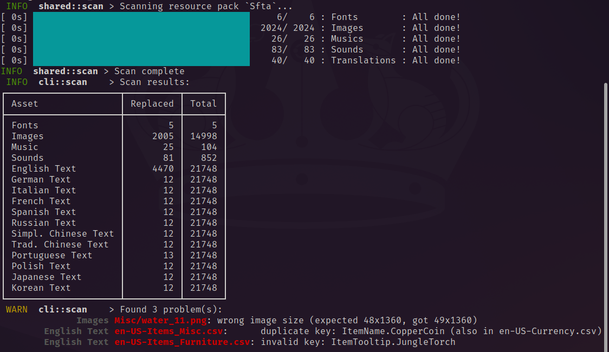
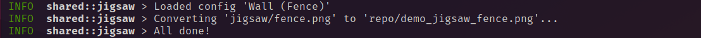
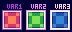
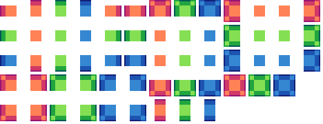
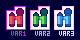
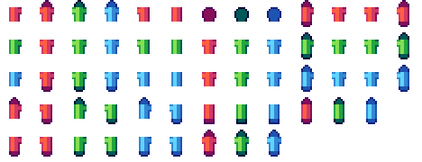
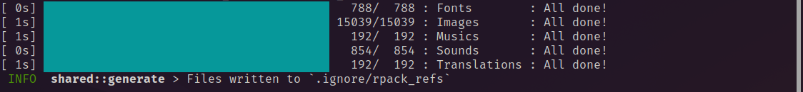

# RPack Toolbox

RPack Toolbox is a tool that aids in the creation of [*Terraria*] [resource
packs](https://terraria.wiki.gg/wiki/Resource_Pack).

> [!NOTE]
> Currently, this program is only available as a command-line tool. However, a
> graphical interface is planned.

## Features

RPack Toolbox's features are divided into Tools.

> [!TIP]
> On the CLI, you can use the `help` command to get more specifc details and
> instructions for each tool.

The tools are as follows:

### Scan

> CLI command: `scan`

Counts how many assets have been replaced, detects invalid assets and displays
other useful information about your pack.



Scan's insights can also be dumped to a JSON file for convenient automation.

### Jigsaw

> CLI command: `jigsaw`

Uses a config file to take an image, cut it into pieces, then rearrange those
pieces into a new image. This is useful for converting simpler tilesets into the
more complicated tilesets used by Terraria.



Here are some examples of what Jigsaw can do, using the configs that come with
the program:

| Input                               | Config       | Output                                          |
| :---------------------------------: | :----------: | :---------------------------------------------: |
|    | `wall.toml`  |    |
|  | `fence.toml` |  |

> [!NOTE]
> The input images are small because, unlike Terraria's assets, we can make the
> inputs unscaled, then have Jigsaw scale the output up for us!

The config are just text files, so you can [write your own
configs](docs/jigsaw_config.md) and share them with others!

### Generate

> CLI command: `gen`

Generates the reference files used by the Scan tool from the extracted
game assets.



> [!NOTE]
> You only need to run this once every game or major RPack update.

## Installation and Setup

Before you install, you currently need to also install trigger-segfault's
[TConvert](https://github.com/trigger-segfault/TConvert) and
[TerrariaLocalizationPacker](https://github.com/trigger-segfault/TerrariaLocalizationPacker)
tools so you can extract the game's assets. RPack expects the extracted assets
to be layed out in the exact way these programs write them.

Use both of those tools to extract the game's assets. They can be extracted
wherever you want, just make sure *both of them write files to the same folder*.
The final folder should look something like this:

```plain_text
ExtractedTerraria/
    Fonts/
        <a bunch of png files>
    Images/
        <some folders and a bunch of png files>
    Sounds/
        <a folder and a bunch of wav files>
    <a bunch of wav files>
    <a bunch of json files>
```

We'll need those files to generate the reference files used by the Scan tool.

Now, install this program. Just look at the latest release to the right, go down
to the `Assets` section, and download the file named after your system.

Run the program from the command line with the following arguments:

```bash
# Add the `.exe` on windows
./rpack_toolbox help gen
```

This command will print instructions on how to use the Generate tool. Follow
them to generate the reference files. From there you can start using the tool!

> [!TIP]
> You can delete the extracted files after using the Generate tool if you want,
> though I'd recommend you keep them around as reference when creating your
> resource packs.

## License

This program is licensed under the [GNU General Public License
version 3.0](LICENSE).

## Junk for Nerds

The remaining sections are mostly relevant to developers. If you're just here to
use the tool, you can stop reading.

### Project Structure

The program is divided into a few crates in a [Cargo] workspace:

```text
shared (the main backend logic)
cli (the CLI frontend)
app (the main binary crate)
```

### Building

If you'd rather build this from the source, clone this repo and build it
with [Cargo]:

```bash
$ git clone https://github.com/ThEnderYoshi/rpack_toolbox.git
$ cd rpack_toolbox
$ cargo build --release
```

The program will be in the `target/release` dir.

<!-- NOTE: Uncomment when features are added
To only build with one of the frontends, enable only one of the `gui` or
`cli` features:

```bash
$ cargo build --release --no-default-features -F gui
$ cargo build --release --no-default-features -F cli
```
-->

If you're on 64-bit x86 Linux, you can also run `build.py` from the root to
create the proper release packages (found under `.release/`), just make sure you
have the proper dependencies installed (see `build.py`'s main docstring for
more information):

```bash
python3 build.py
```

```bash
pydoc3 build # Print the docstring
```

<!-- References -->

[*Terraria*]: https://terraria.org
[Cargo]: https://doc.rust-lang.org/cargo
